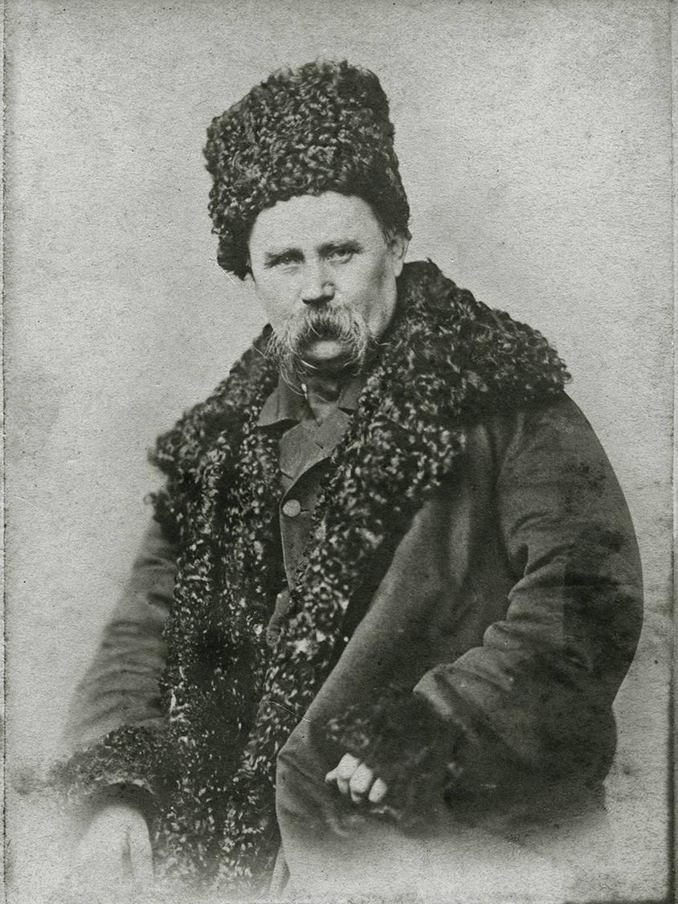

## Try to find the text in this image ;D

## How does my algorithm work?

My program converts each character of your text into a byte string using an ASCII table, then creates a new image, but changes each pixel so if we have one in the bit, we change the transparency of the pixel to 253 if zero, then 254 if there is nothing to write , the pixel is not transparent at all, ie 255.
For the human eye it is not noticeable)